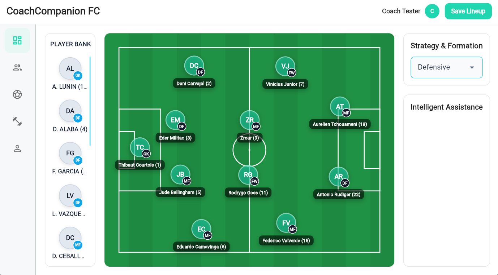

# Football Tactics Manager

Football Tactics Manager is a full-stack coaching application for managing a football team, its squad, tactical setups, and training schedule.

- **Backend:** Laravel 12 API with Sanctum authentication in `backend/`
- **Frontend:** Flutter application for web/mobile/desktop in `frontend/`
- **Goal:** give a coach one place to manage players, organize a starting lineup, build tactics, and plan training sessions

## Dashboard Preview
The dashboard is centered around a visual lineup board with a player bank, tactic selector, draggable player tokens, and quick save actions for the active lineup.



## Main Functionalities

### 1. Authentication and coach onboarding
- Register a new coach account with `name`, `email`, `password`, and `team_name`
- Automatically create the coach's team during registration
- Sign in and sign out with Sanctum token authentication
- Persist the authentication token locally with `SharedPreferences` so the session survives app reloads
- Redirect authenticated users directly to the dashboard shell

### 2. Team management
- Each coach owns a single team through `coach_id`
- Load the current coach's team with player counts and active tactic information
- Rename the team from the profile page
- Persist and switch the team's `active_tactic_id`
- Prevent coaches from changing other teams through Laravel policies

### 3. Dashboard and lineup management
- Show a **Player Bank** containing substitute players
- Show the starting eleven on a tactical pitch
- Drag a substitute from the player bank onto the pitch to replace a starter
- Automatically swap roles when a substitute replaces a starter
- Drag players directly on the pitch to adjust their positions
- Load the active tactic and saved slot positions when the dashboard opens
- Save the current lineup back to the backend through tactic slot position endpoints
- Automatically create a default team tactic if the coach has none yet
- Keep the selected tactic synchronized with the team's active tactic

### 4. Player management
- Create players with:
  - name
  - jersey number
  - position
  - role (`starter` or `substitute`)
  - category (`Goalkeeper`, `Defender`, `Midfielder`, `Forward`)
- Edit existing players
- Delete players
- Enforce team-level jersey number uniqueness in the UI
- Filter players by position, role, and category
- Search players by name
- Sort players by name, jersey number, position, role, and creation date
- Paginate the player table for easier squad management
- Display role and position badges for quick scanning

### 5. Tactics management
- Load both:
  - team-specific tactics
  - global default tactics
- Create new tactics with a custom name and formation
- Validate formation strings so the outfield player total equals 10
- Edit team tactics
- Delete team tactics
- Prevent editing or deleting global default tactics
- Select the active tactic used by the team
- Display saved tactics in a side panel with active/default indicators
- Edit tactical slot positions visually on a dedicated tactic layout pitch
- Save custom slot coordinates for each tactic
- Clone a global tactic into a team tactic when it becomes the active tactic for a coach

### 6. Training session management
- Load training sessions for the authenticated coach's team
- Create training sessions with:
  - title
  - date and start time
  - duration
  - focus area
  - location
  - assigned player count
  - coaching notes
- Edit training sessions
- Delete training sessions
- View session details from the schedule page
- Automatically derive session status as:
  - `Planned`
  - `Ongoing`
  - `Completed`
- Show dashboard-style summary cards for total, upcoming, and completed sessions
- Filter sessions by status

### 7. Profile and coach settings
- Fetch the authenticated coach profile from the backend
- Update coach full name and email
- Update team name from the same page
- Show team statistics:
  - total players
  - total tactics
  - total training sessions
  - total starters
  - total substitutes

### 8. API capabilities available in the backend
- REST-style resources for:
  - teams
  - players
  - tactics
  - training sessions
- Custom endpoints for:
  - login/register/logout
  - profile read/update
  - active tactic selection
  - tactic slot position persistence
  - tactical instruction management
- Policy-based authorization so coaches only access their own data
- Team-scoped tactic and player loading

### 9. Tactical instructions support
- The backend already supports tactical instructions linked to tactics and players
- Coaches can create, list, and delete tactical instructions through the API
- Each instruction can target multiple players on the same team
- The current Flutter UI includes an **Intelligent Assistance** panel placeholder on the dashboard, but a full tactical-instruction editor is not wired into the frontend yet

## Seeded Demo Data
Running `php artisan migrate --seed` seeds the project with:

- player categories
- a demo coach account
- `Real Madrid CF`
- a full sample squad including starters and substitutes
- default team tactics and tactic slot positions

The seeders are written to be repeatable, so you can reseed without hitting the previous duplicate team issue.

## Backend Setup
```bash
cd backend
composer install
cp .env.example .env
php artisan key:generate
php artisan migrate --seed
php artisan serve
```

Default local API URL:

```text
http://127.0.0.1:8000
```

## Frontend Setup
```bash
cd frontend
flutter pub get
flutter config --enable-web
flutter run -d chrome --web-browser-flag="--window-size=1024,1366"
```

The frontend API base URL is configured in `frontend/lib/core/env.dart` and `frontend/lib/core/api_client.dart`.

## Quick API Testing
Import the Postman files from `backend/`, then test:

1. `POST /api/register`
2. `POST /api/login`
3. `GET /api/profile`
4. `GET /api/players`
5. `GET /api/tactics`
6. `GET /api/training-sessions`

## Project Structure
- `backend/`: Laravel API, authentication, policies, models, migrations, and seeders
- `backend/routes/api.php`: all REST and custom API routes
- `backend/app/Http/Controllers/Api/`: business logic for auth, players, tactics, teams, training, and tactical instructions
- `backend/database/seeders/`: demo data for categories, team, players, and tactics
- `frontend/lib/screens/`: app entry screens such as login and shell navigation
- `frontend/lib/pages/`: feature pages for dashboard, players, tactics, training, and profile
- `frontend/lib/widgets/`: reusable pitch and player widgets
- `frontend/lib/services/`: API wrappers for auth, players, and tactics

## Useful Commands
- Refresh the database with seed data: `cd backend && php artisan migrate:fresh --seed`
- Run Laravel tests: `cd backend && php artisan test`
- Run Flutter tests: `cd frontend && flutter test`

## Current Notes
- The dashboard lineup editor is fully functional for drag, drop, swap, and save flows
- Tactical instructions are implemented in the backend API but not yet exposed as a complete Flutter page
- The `Intelligent Assistance` panel is currently a UI placeholder
